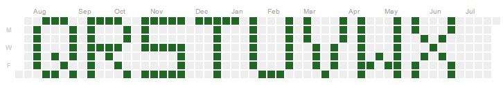

# GhCM

**G**it**H**ub **C**ontributions **M**essage is a small ultility used to write a message in your Contributions graph.

Inspired by https://github.com/avinassh/rockstar

#Alphabet

#Colors

# Usage
Requires: ~~[GitPython 1.0.2](https://github.com/gitpython-developers/GitPython)~~ **Build from [Source](https://github.com/gitpython-developers/GitPython) until 1.0.2 is realeased**

	[Click 4.1](http://click.pocoo.org/)

	Usage: GhCM.py [OPTIONS] MESSAGE

	Options:
  	 --textColor INTEGER RANGE          Changes color of text, 0 = lightest | 4 = darkest.
 	 --backgroundColor INTEGER RANGE    Changes color of background, 0 = lightest | 4 = darkest.
  	 --help                             Show this message and exit.

The message should be less than 8 characters, or else it won't fit. GhCM will create a folder called "GhCM - \<Message\>", simply push this folder to a repo on your github and the message will appear. If you want to remove a message simply delete the repo from GitHub.

# Issues
 * Waiting on GitPython 1.0.2 to be released for [Feature #317](https://github.com/gitpython-developers/GitPython/pull/317), though the current version on GitHub works.

# To Do:
  * Test if possible to commit to the future
  * Add punctuation
  * Add lower case letters
